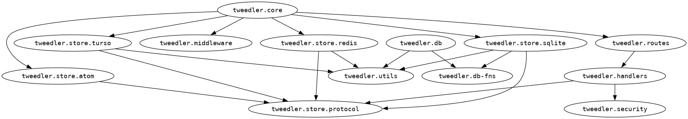

# Tweedler

A simple app for practicing Clojure.



## Test

Run all tests:

```sh
bb tests
```

## Build

Create an uberjar:

```sh
bb build:uberjar
```

Run the uberjar:

```sh
java -jar $JVM_OPTS target/tweedler-standalone.jar
```

## Containerized app

Build the container image and give it a name and a version tag:

```shell
bb container:build
```

Run the container:

```shell
bb container:run
```

## Other

Generate a graph of dependencies between namespaces using [clj-hiera](https://github.com/greglook/clj-hiera). You will need to have [Graphviz](https://graphviz.org/) installed.

```sh
bb graph
```

[Live logs](Live Logs) on Fly.io.
